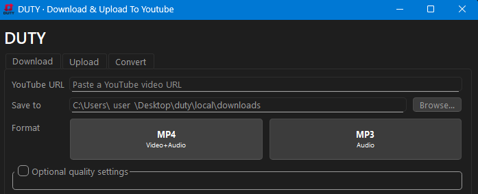
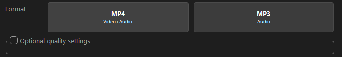
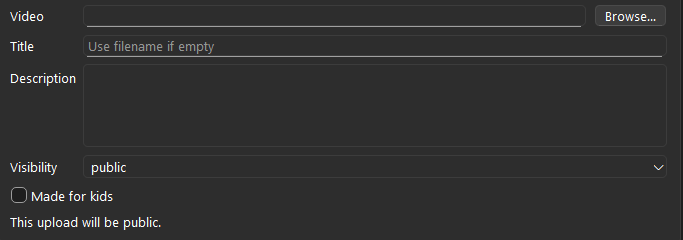
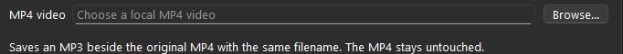
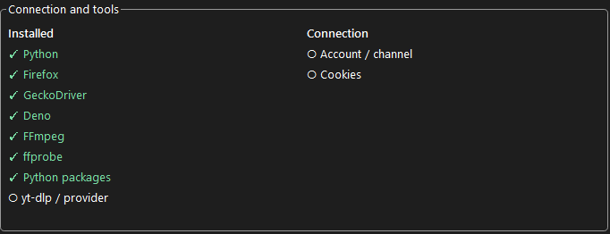

<p align="center">
  
</p>

<h3 align="center">Download & Upload To YouTube</h3>

<p align="center">
  
  
  
</p>

DUTY is a small Windows app that does three things: it **downloads** YouTube
videos (as MP4 or MP3), **uploads** your own videos to your channel, and
**converts** MP4 files you already have into MP3s.

You can use it through a simple desktop window, or automate it from the command
line if you'd rather script things. There are no API keys to set up and no
third-party services involved. It signs in to YouTube through a real Firefox
window, just like you would.

<p align="center">
  
</p>

## Before you start

You need **Python 3.11 or newer** (64-bit, with pip) to get going. If you don't
have it, grab it from [python.org](https://www.python.org/downloads/windows/) and
tick **"Add python.exe to PATH"** in the installer.

That's the only thing you install yourself. DUTY downloads everything else it
needs (its own portable Python, Firefox, GeckoDriver, FFmpeg, Deno and the Python
packages) into the project folder. It doesn't touch your system PATH or your
normal browser.

## Getting started

1. Clone the repo (or download it as a ZIP and extract it):

   ```bash
   git clone https://github.com/Eianex/duty.git
   ```

2. Double-click **`DUTY.exe`** in the project folder.

   The first time, DUTY notices it isn't set up yet and does it for you. A small
   **DUTY setup** window appears and shows what's being downloaded and installed.
   This takes a few minutes, and when it's done the app opens on its own. From
   then on, double-clicking `DUTY.exe` opens the app straight away.

3. The first time you download or upload, DUTY opens Firefox and asks you to sign
   in to Google. Sign in, get through any verification prompts and pick your
   channel. DUTY saves the session, so you won't have to do this again for a while.

When you pull a new version of DUTY, just open `DUTY.exe` as usual. If the update
needs anything new, the setup window shows up again and installs only what's
missing. Your login and history stay as they are.

<details>
<summary>If setup can't find Python or something goes wrong</summary>

The setup window uses the Python you installed, so it has to be able to find it.
If it can't, it tells you so. Install Python 3.11+ (with "Add python.exe to PATH"
ticked) and double-click `DUTY.exe` again.

If setup fails partway, the window shows what happened, and the full log is saved
in `local/logs/launcher-setup.log`. Double-clicking `DUTY.exe` again retries, and
anything that was already installed is kept.

You can also run setup yourself from a terminal in the project folder:

```bash
python src/main.py setup
```

</details>

## Using the app

The window has three tabs. Only one job runs at a time, and you can cancel it
from the button below the form.

### Download

Paste a YouTube link, pick where to save it, and choose a format.
**MP4** gets the best video and audio YouTube has, without re-encoding. **MP3**
grabs the best audio and turns it into an MP3. If you need an exact resolution,
open **Optional quality settings** and pick 1080p or 4K. The download fails
instead of quietly giving you something smaller.

<p align="center">
  
</p>

By default, files go to `local/downloads/`. If a download gets interrupted, running
it again with the same options picks up where it left off.

### Upload

Pick an MP4 or MKV, give it a title (or leave it empty to use the filename), a
description, a visibility and an audience. Uploads are **public** and **not made
for kids** unless you change them, and the window always tells you which
visibility you're about to use.

<p align="center">
  
</p>

### Convert

Choose an MP4 on your computer and DUTY saves an MP3 next to it with the same
name. Your original file isn't changed, and an existing MP3 is never replaced.
This works offline and doesn't need a YouTube login.

<p align="center">
  
</p>

### The status panel

At the bottom, DUTY checks its tools and your saved login when it starts. A green
✓ means the check passed, ○ means it's still checking or needs your attention,
and ✕ means something failed. **Refresh login** reopens Firefox if you ever
need to sign in again.

<p align="center">
  
</p>

A green panel means your setup is ready. It can't promise YouTube won't throw a
bot check at you later.

## Using the command line

Everything the window does is also available as a command, which is handy for
scripts, scheduled tasks or other tools.

| What you want | Command |
|---|---|
| Sign in (or refresh the login) | `python src/main.py login` / `login --refresh` |
| Check that everything is ready | `python src/main.py status` |
| Download a video | `python src/main.py download "URL"` |
| Download audio only | `python src/main.py download "URL" --format mp3` |
| Convert an MP4 to MP3 | `python src/main.py convert "clip.mp4"` |
| Upload a video | `python src/main.py upload "clip.mp4" --title "My video"` |
| See past transfers | `python src/main.py history` |

A few more options:

```bash
python src/main.py download "URL" --output "D:\Videos" --exact-1080
python src/main.py download "URL" --exact-4k
python src/main.py convert "clip.mp4" --overwrite
python src/main.py upload "clip.mkv" --visibility private --description "Behind the scenes"
python src/main.py status --online
```

Run `python src/main.py --help` (or `--help` after any command) to see everything.

### Upload details from a file

Instead of passing the title and description on the command line, you can put a
`metadata.json` next to the video (or point to one with `--metadata PATH`):

```json
{"title": "My video", "description": "", "visibility": "public", "made_for_kids": false}
```

Command-line options win over the file, and the file wins over `settings.toml`.
Use `--made-for-kids` / `--no-made-for-kids` to set the audience, and
`--headless` to hide the upload browser. The login window is always visible.

### Automating it

Add `--json` for machine-readable output and `--non-interactive` so DUTY never
pops up a login window in the middle of a script:

```bash
python src/main.py --json --non-interactive download "URL"
```

The JSON result goes to stdout and progress goes to stderr. Exit codes are
`0` success, `1` failure (or an upload that couldn't be confirmed), `2` login
needed and `130` cancelled.

## Using it from Python

If you'd rather call DUTY from your own script, put the script in the project
folder (or add the folder to your import path) and use the same helpers the app
uses:

```python
from src.core import Config
from src.download import download_video, convert_video
from src.upload import upload_video

config = Config()
config.non_interactive = True

result = download_video("https://www.youtube.com/watch?v=VIDEO_ID", config=config)
print(result.to_dict())

# convert_video("clip.mp4", config=config)
# upload_video("clip.mkv", config=config, title="My video", visibility="private")
```

`config.on_event` receives progress updates, and `config.cancel_event.set()`
asks the current job to stop.

## Where your stuff lives

- **`settings.toml`** has the upload defaults (visibility, audience, headless)
  and a few timeouts. It's the only config file.
- **`local/`** holds everything else: the downloaded tools, your saved login and
  cookies, downloads, history and caches. It's ignored by Git.

You can move the whole folder somewhere else and it keeps working. Don't share
your `local/` folder with anyone, though, because it's signed in to your account.
If you manage more than one channel, use a separate copy of DUTY for each.

## If an upload gets stuck

Occasionally YouTube Studio doesn't clearly confirm that an upload finished.
When that happens, DUTY marks the upload as *unresolved* and refuses to upload
the same file again, so you never end up with a duplicate video. It also happens
if you cancel or close the window after the file has started uploading.

Check your channel in YouTube Studio, then tell DUTY what happened:

```bash
python src/main.py history --resolve upload_JOB_ID --status completed --video-id VIDEO_ID
```

If you're sure no video was created, use `--status failed` instead. That lets you
try the upload again.

## What it doesn't do (yet)

DUTY handles one video at a time. It doesn't do playlists, batches, search,
scheduled uploads, thumbnails, tags, playlist management or editing videos that
are already on your channel.

> **Heads-up:** If something looks off, please open an issue.

## Credits & licenses

DUTY's own code is [MIT licensed](LICENSE). It stands on the shoulders of
[yt-dlp](https://github.com/yt-dlp/yt-dlp), FFmpeg, Firefox, GeckoDriver, Deno,
PySide6 and the [BgUtils PO-token provider](https://github.com/Brainicism/bgutil-ytdlp-pot-provider),
which keep their own licenses (BgUtils is GPL-3.0). See
[THIRD_PARTY.md](THIRD_PARTY.md) for the full details.

Working on the code? [AGENTS.md](AGENTS.md) and
[`.agents/docs/project.md`](.agents/docs/project.md) explain how the project is put together.
